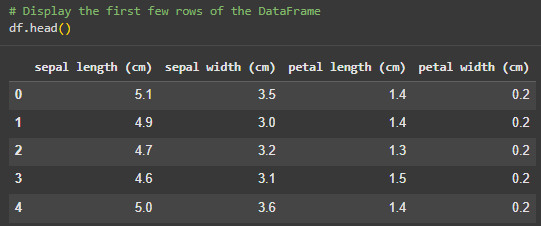
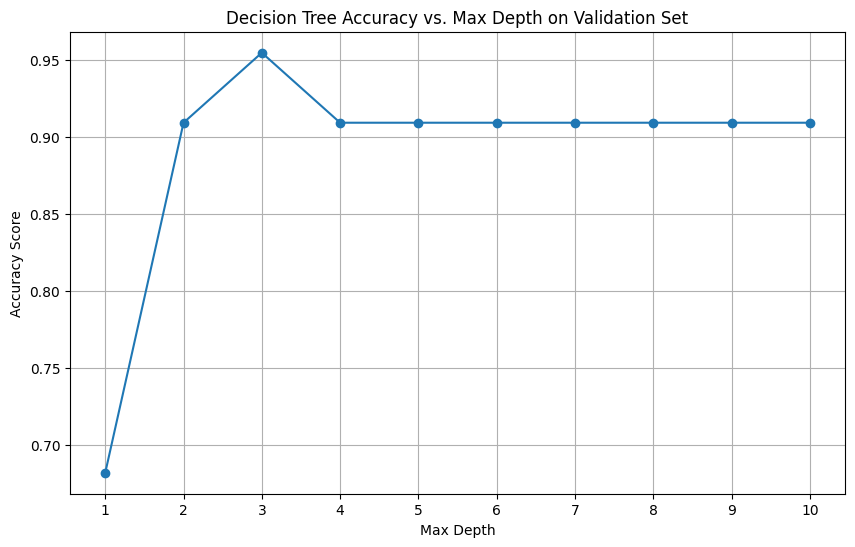
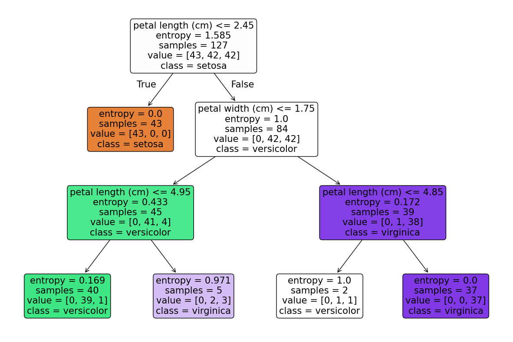
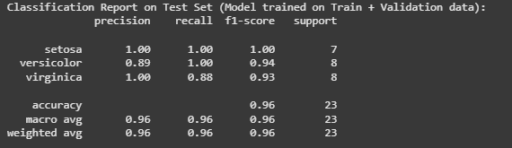

# Iris Decision Tree (CS471 Assignment 4)

Train and evaluate a Decision Tree classifier on the classic **Iris** dataset.  
This repository includes a runnable Python script that mirrors a Google Colab workflow (EDA, train/val/test split, simple hyperparameter sweep, final model, metrics, and tree visualization).

## Project Structure
```
.
├─ src/
│ └─ iris-DT-clf.py
├─ notebooks/
│ └─ CS471assignment4.ipynb
├─ images/ # result images (accuracy, tree, report, data)
├─ requirements.txt 
├─ .gitignore 
├─ LICENSE 
└─ README.md 
```

## Quickstart (Local)

### 1) Create and activate a virtual environment
```bash
# Windows (PowerShell)
python -m venv .venv
.\.venv\Scripts\Activate.ps1

# macOS / Linux
python3 -m venv .venv
source .venv/bin/activate
```

### 2) Install dependencies
```bash
pip install -r requirements.txt
```

### 3) Run the script
```bash
python src/iris-DT-clf.py
```
## Notes
- The implementation uses the following defaults: criterion='entropy', sweeps max_depth values from 1 to 10, and trains a final model with max_depth=3 (configurable).
- Random seeds are fixed for reproducibility (random_state=42).


## Results

### Data Sample


### Accuracy vs Max Depth


### Decision Tree Visualization


### Classification Report

